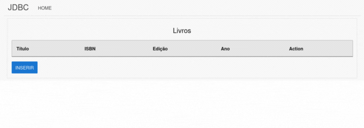

<div class="header" style="text-align: center">
    <h1>Intro-JDBC</h1>
    
</div>

## Índice

- [Sobre](#sobre)
- [Tecnologias utilizadas](#tecnologias-utilizadas)
- [Como utilizar o projeto](#como-utilizar-o-projeto)
    - [Requerimentos necessários](#requerimentos-necessários)
    - [Criando a base de dados](#criando-a-base-de-dados)
    - [Configuração](#configuração)
         
## Sobre

Este projeto fornece uma introdução prática e didática ao uso do JDBC (Java Database Connectivity), uma API do Java para interagir com bancos de dados relacionais.

## Tecnologias utilizadas

O projeto foi desenvolvido utilizando as seguintes tecnologias:

- Java 8
- Servlet 4
- JSTL 1.2
- Lombok 1.18
- JavaFaker 1.0
- Dotenv 2.3
- MySQL 8

## Como utilizar o projeto

### Requerimentos necessários

- Java 8 previamente configurado
- MySQL 8 previamente configurado

### Criando a base de dados

```sql
# logue no MySQL
mysql> create database livraria;
mysql> use livraria;
mysql> create table livros (
    isbn CHAR(13) not null primary key, 
    titulo varchar(50),  
    edicao tinyint(2), 
    ano year, 
    descricao text);
mysql> desc livros;
+-----------+-------------+------+-----+---------+-------+
| Field     | Type        | Null | Key | Default | Extra |
+-----------+-------------+------+-----+---------+-------+
| isbn      | char(13)    | NO   | PRI | NULL    |       |
| titulo    | varchar(50) | YES  |     | NULL    |       |
| edicao    | tinyint     | YES  |     | NULL    |       |
| ano       | year        | YES  |     | NULL    |       |
| descricao | text        | YES  |     | NULL    |       |
+-----------+-------------+------+-----+---------+-------+


```

### Configuração

```bash
# clone o projeto
$ git clone https://github.com/shifttodev/intro-jdbc.git

# crie um arquivo .env no diretório resources
$ touch src/main/resources/.env

# adicione e configure as seguintes variáveis de ambiente no .env 
DB_URL=jdbc:mysql://url-do-banco-de-dados/livraria
DB_USER=usuario
DB_PASSWORD=senha
```
